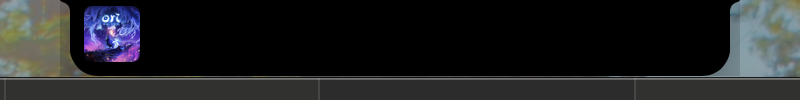
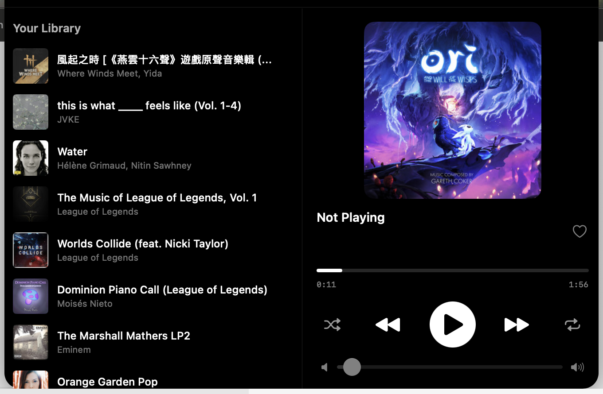

# SpotifyIsland

A macOS notch-style Spotify player that lives around your MacBook's notch — inspired by Dynamic Island.


<p align="center">
  
  <br><em>Collapsed — album art in the notch</em>
</p>

<p align="center">
  
  <br><em>Expanded — full player with album library</em>
</p>

## Features

- **Notch integration** — sits seamlessly around the MacBook notch
- **Collapsed view** — album art + current time, always visible
- **Expanded view** — hover to reveal full player with:
  - Album artwork and track info
  - Play/pause, skip, shuffle, repeat controls
  - Seek bar and volume slider
  - Like button
  - Your saved albums library (click to play)
- **Standalone playback** — plays audio via Spotify Web Playback SDK, no Spotify desktop app needed
- **OAuth 2.0 PKCE** — secure authentication, no client secret required

## Requirements

- macOS 14+ (Sonnet) with a notched MacBook
- Swift 5.9+
- A **Spotify Premium** account (required for Web Playback SDK)
- A Spotify Developer App (free to create)

## Setup

### 1. Create a Spotify App

1. Go to [developer.spotify.com/dashboard](https://developer.spotify.com/dashboard)
2. Click **Create App**
3. Fill in any name/description
4. Add this **Redirect URI**: `spotifyisland://callback`
5. Check **Web Playback SDK** and **Web API**
6. Save and copy your **Client ID**

### 2. Configure

Set your Client ID as an environment variable:

```bash
export SPOTIFY_CLIENT_ID="your_client_id_here"
```

Or edit `SpotifyIsland/Services/SpotifyAuthService.swift` directly and replace `YOUR_SPOTIFY_CLIENT_ID`.

### 3. Build & Run

```bash
# Build, install to ~/Applications, and launch
make run
```

Or step by step:

```bash
swift build -c release
make install
open ~/Applications/SpotifyIsland.app
```

### 4. Login

- Click the **music note** icon in the menu bar → **Login with Spotify**
- Or hover over the notch to expand, then click **Login**
- Authorize on the Spotify web page — the app handles the rest

## Usage

| Action | How |
|--------|-----|
| Expand player | Hover over the notch |
| Collapse | Move mouse away |
| Play an album | Click it in the left panel |
| Control playback | Use the transport controls |
| Adjust volume | Drag the volume slider |
| Like a track | Click the heart icon |
| Context menu | Right-click the notch |

## Architecture

```
SpotifyIsland/
├── Models/          — Spotify API data models
├── Services/        — Auth (PKCE), API, Keychain, Web Playback
├── ViewModels/      — Player state management
├── Views/           — SwiftUI views (Island, Player, Albums, Login)
└── Helpers/         — Floating panel & window management
```

Key decisions:
- **NSPanel** at `.statusBar` level with passthrough hit testing
- **Actor-based services** for thread-safe API and auth
- **WKWebView** in an offscreen window for Spotify Web Playback SDK
- **PKCE flow** with URL scheme callback — no client secret needed

## Troubleshooting

**No sound?**
Make sure Spotify isn't playing on another device. The app transfers playback to its built-in "SpotifyIsland" player on login.

**Login not working?**
Verify `spotifyisland://callback` is listed as a Redirect URI in your Spotify dashboard.

**Buttons not clickable?**
Right-click the notch → Quit, then relaunch. The floating panel occasionally needs a fresh start.

## License

MIT
